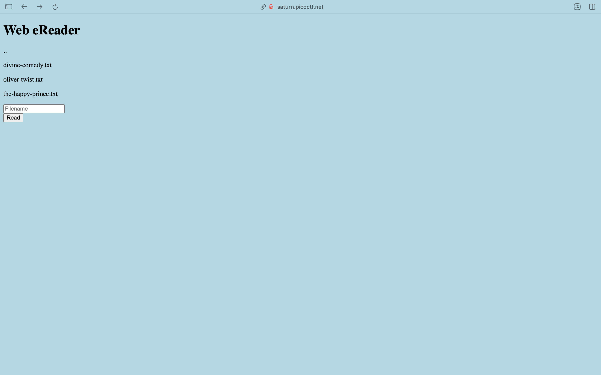

We'll we've got a website with a field to enter files.

Let's try the most obvious solution and enter `/flag.txt`

Let's try giving a relative path which goes all the way back like `../../../../../../../../../../../flag.txt`

(That quite surprisingly worked, and we've got the flag... That was pleasantly easy!)
