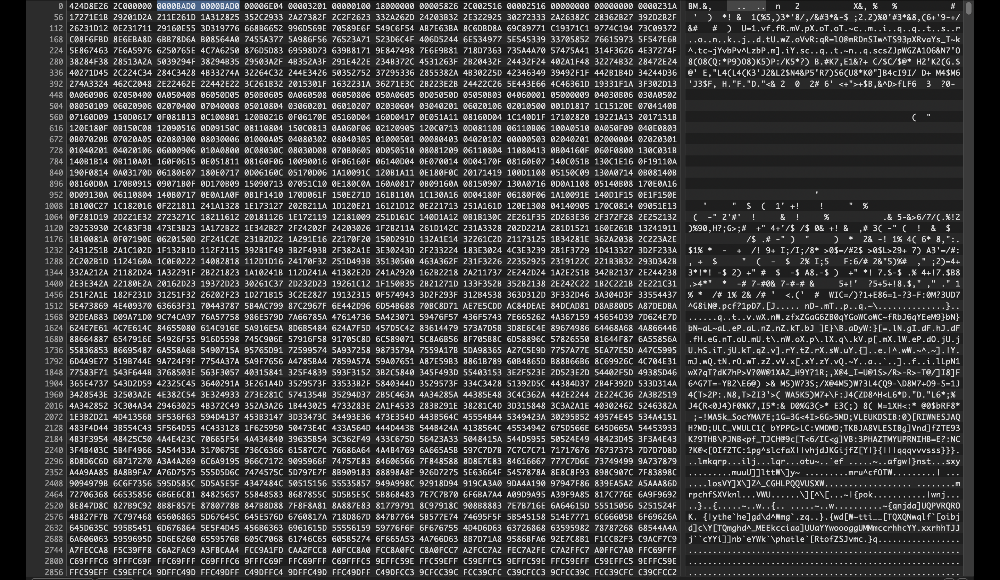

# trivial flag transfer protocol
We get a file named `tftp.pcapng`, which is a network capture file, we open it with Wireshark, and are greeted with this:

Few things immediately standout, some files are being transferred via `TFTP` protocol by simply glancing at the `1`st, `19`th and `22`nd record.

Now that it's obvious, let's attempt to extract those files.
We navigate to `File > Export Objects > TFTP` and are met with this screen,

we save those files to disk to further to analyze them.

The files `instructions.txt` and `plan` seems to be all garbled up.
```sh
achu@air files % cat instructions.txt 
GSGCQBRFAGRAPELCGBHEGENSSVPFBJRZHFGQVFTHVFRBHESYNTGENAFSRE.SVTHERBHGNJNLGBUVQRGURSYNTNAQVJVYYPURPXONPXSBEGURCYNA
achu@air files % cat plan 
VHFRQGURCEBTENZNAQUVQVGJVGU-QHRQVYVTRAPR.PURPXBHGGURCUBGBF 
```
I consult with `dcode.fr` on what the encryption made here could be and it suggested `ROT13`, so we decode it using the same.
```
instructions.txt:
TFTPDOESNTENCRYPTOURTRAFFICSOWEMUSTDISGUISEOURFLAGTRANSFER.FIGUREOUTAWAYTOHIDETHEFLAGANDIWILLCHECKBACKFORTHEPLAN

plan:
IUSEDTHEPROGRAMANDHIDITWITH-DUEDILIGENCE.CHECKOUTTHEPHOTOS
```
Speaking of the program, 
```sh
achu@air files % tar xvf program.deb 
x debian-binary
x control.tar.gz
x data.tar.xz
achu@air files % tar xvf control.tar.gz 
x ./
x ./md5sums
x ./control
achu@air files % cat control
Package: steghide
Source: steghide (0.5.1-9.1)
Version: 0.5.1-9.1+b1
Architecture: amd64
Maintainer: Ola Lundqvist <opal@debian.org>
Installed-Size: 426
Depends: libc6 (>= 2.2.5), libgcc1 (>= 1:4.1.1), libjpeg62-turbo (>= 1:1.3.1), libmcrypt4, libmhash2, libstdc++6 (>= 4.9), zlib1g (>= 1:1.1.4)
Section: misc
Priority: optional
Description: A steganography hiding tool
 Steghide is steganography program which hides bits of a data file
 in some of the least significant bits of another file in such a way
 that the existence of the data file is not visible and cannot be proven.
 .
 Steghide is designed to be portable and configurable and features hiding
 data in bmp, wav and au files, blowfish encryption, MD5 hashing of
 passphrases to blowfish keys, and pseudo-random distribution of hidden bits
 in the container data.
achu@air files % tar xvf data.tar.xz   
x ./
x ./usr/
x ./usr/share/
x ./usr/share/doc/
x ./usr/share/doc/steghide/
x ./usr/share/doc/steghide/ABOUT-NLS.gz
x ./usr/share/doc/steghide/LEAME.gz
x ./usr/share/doc/steghide/README.gz
x ./usr/share/doc/steghide/changelog.Debian.gz
x ./usr/share/doc/steghide/changelog.Debian.amd64.gz
x ./usr/share/doc/steghide/changelog.gz
x ./usr/share/doc/steghide/copyright
x ./usr/share/doc/steghide/TODO
x ./usr/share/doc/steghide/HISTORY
x ./usr/share/doc/steghide/CREDITS
x ./usr/share/doc/steghide/BUGS
x ./usr/share/man/
x ./usr/share/man/man1/
x ./usr/share/man/man1/steghide.1.gz
x ./usr/share/locale/
x ./usr/share/locale/ro/
x ./usr/share/locale/ro/LC_MESSAGES/
x ./usr/share/locale/ro/LC_MESSAGES/steghide.mo
x ./usr/share/locale/fr/
x ./usr/share/locale/fr/LC_MESSAGES/
x ./usr/share/locale/fr/LC_MESSAGES/steghide.mo
x ./usr/share/locale/de/
x ./usr/share/locale/de/LC_MESSAGES/
x ./usr/share/locale/de/LC_MESSAGES/steghide.mo
x ./usr/share/locale/es/
x ./usr/share/locale/es/LC_MESSAGES/
x ./usr/share/locale/es/LC_MESSAGES/steghide.mo
x ./usr/bin/
x ./usr/bin/steghide
achu@air files % 
```
It's highly obvious that `steghide` was used to hide some data in the three images we extracted from `TFTP` traffic.

Using `Aperi'Solve`, we were also get some passwords `3_PHyg2bN!M<1YJ2]Nd`, `DUEDILIGENCE` from previous uploads (connecting the dots the mention of `DUEDILIGENCE` was also made in the `plan` file, so that was a hint). However, the first file did  not have any extractable data.

Great, we inspect second file which was a bit too big to upload to aperi'solve (lol), so I diverted by attention to the third file.
After uploading it to aperi'solve and giving it the right password we DO have steghide output

I download and extract the steghide extract and am greeted with the `flag.txt` file.
```bash
(base) achu@air Downloads % cat flag.txt  
picoCTF{h1dd3n_1n_pLa1n_51GHT_18375919}
(base) achu@air Downloads % 
```
The flag is: `picoCTF{h1dd3n_1n_pLa1n_51GHT_18375919}`

# tunn3l v1s10n
We get a file named `tunn3l_v1s10n`, now we have to figure out what it is and how to get our flag from it.
```bash
achu@air ~ % file /Users/achu/Downloads/tunn3l_v1s10n 
/Users/achu/Downloads/tunn3l_v1s10n: data
achu@air ~ % binwalk /Users/achu/Downloads/tunn3l_v1s10n 
Analyzed 1 file for 85 file signatures (187 magic patterns) in 27.0 milliseconds
achu@air ~ % sf /Users/achu/Downloads/tunn3l_v1s10n    
---
siegfried   : 1.11.1
scandate    : 2024-11-04T00:54:02+05:30
signature   : default.sig
created     : 2024-06-21T16:01:11+10:00
identifiers : 
  - name    : 'pronom'
    details : 'DROID_SignatureFile_V118.xml; container-signature-20240501.xml'
---
filename : '/Users/achu/Downloads/tunn3l_v1s10n'
filesize : 2893454
modified : 2024-11-04T00:27:44+05:30
errors   : 
matches  :
  - ns      : 'pronom'
    id      : 'UNKNOWN'
    format  : 
    version : 
    mime    : 
    class   : 
    basis   : 
    warning : 'no match'
```
`TRid` did not return any results either.
we're off to a spectacularly bad start...
Let's see the hex dump
```bash
achu@air ~ % xxd /Users/achu/Downloads/tunn3l_v1s10n 
00000000: 424d 8e26 2c00 0000 0000 bad0 0000 bad0  BM.&,...........
00000010: 0000 6e04 0000 3201 0000 0100 1800 0000  ..n...2.........
00000020: 0000 5826 2c00 2516 0000 2516 0000 0000  ..X&,.%...%.....
00000030: 0000 0000 0000 231a 1727 1e1b 2920 1d2a  ......#..'..) .*
00000040: 211e 261d 1a31 2825 352c 2933 2a27 382f  !.&..1(%5,)3*'8/
00000050: 2c2f 2623 332a 262d 2420 3b32 2e32 2925  ,/&#3*&-$ ;2.2)%
00000060: 3027 2333 2a26 382c 2836 2b27 392d 2b2f  0'#3*&8,(6+'9-+/
00000070: 2623 1d12 0e23 1711 2916 0e55 3d31 9776  &#...#..)..U=1.v
00000080: 668b 6652 996d 569e 7058 9e6f 549c 6f54  f.fR.mV.pX.oT.oT
00000090: ab7e 63ba 8c6d bd8a 69c8 9771 c193 71c1  .~c..m..i..q..q.
000000a0: 9774 c194 73c0 9372 c08f 6fbd 8e6e ba8d  .t..s..r..o..n..
```
Search wikipedia for matching magic number/binary signature


With a bit of digging it can be found that some static values of BMP are actually switched out in the hexdump


Correcting the values 


And... we can now open the file.

However there seems to be a sizing issue

Find the resolution
```bash
achu@air ~ % file /Users/achu/Downloads/tunn3l_v1s10n.bmp 
/Users/achu/Downloads/tunn3l_v1s10n.bmp: PC bitmap, Windows 3.x format, 1134 x 306 x 24, image size 2893400, resolution 5669 x 5669 px/m, cbSize 2893454, bits offset 54
achu@air ~ % 
```

Height and Width comes after the value we assigned `28` to.

Bitmap template tool in Hexfiend was a great aid


We edit those to a higher value (specfically set height to `900`, ie, `0x384`)
So we edit the value from `32 01` to `84 03`, and we finally get the flag!!!


The flag is `picoCTF{qu1t3_a_v13w_2020}`.


# m00nwalk
We get a `wav` file, and from the gist of the following hint
> How did pictures from the moon landing get sent back to Earth? 

It can be assumed that this audio is some protocol for relaying images from moon.

From the wikipedia research, it is clear that `SSTV` was used for capturing moments of moon walk.
I found this [SSTV decoder on github](https://github.com/colaclanth/sstv)
(It uses deprecated practices but it seems to be what we want)
```bash
~/SandBox$ git clone https://github.com/colaclanth/sstv.git
Cloning into 'sstv'...
remote: Enumerating objects: 221, done.
remote: Counting objects: 100% (59/59), done.
remote: Compressing objects: 100% (10/10), done.
remote: Total 221 (delta 51), reused 49 (delta 49), pack-reused 162 (from 1)
Receiving objects: 100% (221/221), 1.01 MiB | 5.58 MiB/s, done.
Resolving deltas: 100% (139/139), done.
~/SandBox/sstv$ python setup.py install
running install
/nix/store/wblvmd5y7izx0z10d1w7ga7zc4apjxmb-python3.11-setuptools-75.1.1/lib/python3.11/site-packages/setuptools/_distutils/cmd.py:66: SetuptoolsDeprecationWarning: setup.py install is deprecated.
!!

        ********************************************************************************
        Please avoid running ``setup.py`` directly.
        Instead, use pypa/build, pypa/installer or other
        standards-based tools.

        See https://blog.ganssle.io/articles/2021/10/setup-py-deprecated.html for details.
        ********************************************************************************

!!
  self.initialize_options()
/nix/store/wblvmd5y7izx0z10d1w7ga7zc4apjxmb-python3.11-setuptools-75.1.1/lib/python3.11/site-packages/setuptools/_distutils/cmd.py:66: EasyInstallDeprecationWarning: easy_install command is deprecated.
!!

        ********************************************************************************
        Please avoid running ``setup.py`` and ``easy_install``.
        Instead, use pypa/build, pypa/installer or other
        standards-based tools.

        See https://github.com/pypa/setuptools/issues/917 for details.
        ********************************************************************************

!!
  self.initialize_options()
running bdist_egg
running egg_info
creating sstv.egg-info
writing sstv.egg-info/PKG-INFO
writing dependency_links to sstv.egg-info/dependency_links.txt
writing entry points to sstv.egg-info/entry_points.txt
writing requirements to sstv.egg-info/requires.txt
writing top-level names to sstv.egg-info/top_level.txt
writing manifest file 'sstv.egg-info/SOURCES.txt'
reading manifest file 'sstv.egg-info/SOURCES.txt'
adding license file 'LICENSE'
writing manifest file 'sstv.egg-info/SOURCES.txt'
installing library code to build/bdist.linux-x86_64/egg
running install_lib
running build_py
creating build/lib/sstv
copying sstv/__init__.py -> build/lib/sstv
copying sstv/__main__.py -> build/lib/sstv
copying sstv/command.py -> build/lib/sstv
copying sstv/common.py -> build/lib/sstv
copying sstv/decode.py -> build/lib/sstv
copying sstv/spec.py -> build/lib/sstv
creating build/bdist.linux-x86_64/egg
creating build/bdist.linux-x86_64/egg/sstv
copying build/lib/sstv/__init__.py -> build/bdist.linux-x86_64/egg/sstv
copying build/lib/sstv/__main__.py -> build/bdist.linux-x86_64/egg/sstv
copying build/lib/sstv/command.py -> build/bdist.linux-x86_64/egg/sstv
copying build/lib/sstv/common.py -> build/bdist.linux-x86_64/egg/sstv
copying build/lib/sstv/decode.py -> build/bdist.linux-x86_64/egg/sstv
copying build/lib/sstv/spec.py -> build/bdist.linux-x86_64/egg/sstv
byte-compiling build/bdist.linux-x86_64/egg/sstv/__init__.py to __init__.cpython-311.pyc
byte-compiling build/bdist.linux-x86_64/egg/sstv/__main__.py to __main__.cpython-311.pyc
byte-compiling build/bdist.linux-x86_64/egg/sstv/command.py to command.cpython-311.pyc
byte-compiling build/bdist.linux-x86_64/egg/sstv/common.py to common.cpython-311.pyc
byte-compiling build/bdist.linux-x86_64/egg/sstv/decode.py to decode.cpython-311.pyc
byte-compiling build/bdist.linux-x86_64/egg/sstv/spec.py to spec.cpython-311.pyc
creating build/bdist.linux-x86_64/egg/EGG-INFO
copying sstv.egg-info/PKG-INFO -> build/bdist.linux-x86_64/egg/EGG-INFO
copying sstv.egg-info/SOURCES.txt -> build/bdist.linux-x86_64/egg/EGG-INFO
copying sstv.egg-info/dependency_links.txt -> build/bdist.linux-x86_64/egg/EGG-INFO
copying sstv.egg-info/entry_points.txt -> build/bdist.linux-x86_64/egg/EGG-INFO
copying sstv.egg-info/requires.txt -> build/bdist.linux-x86_64/egg/EGG-INFO
copying sstv.egg-info/top_level.txt -> build/bdist.linux-x86_64/egg/EGG-INFO
zip_safe flag not set; analyzing archive contents...
creating dist
creating 'dist/sstv-0.1-py3.11.egg' and adding 'build/bdist.linux-x86_64/egg' to it
removing 'build/bdist.linux-x86_64/egg' (and everything under it)
Processing sstv-0.1-py3.11.egg
Copying sstv-0.1-py3.11.egg to /home/runner/SandBox/.pythonlibs/lib/python3.11/site-packages
Adding sstv 0.1 to easy-install.pth file
Installing sstv script to /home/runner/SandBox/.pythonlibs/bin

Installed /home/runner/SandBox/.pythonlibs/lib/python3.11/site-packages/sstv-0.1-py3.11.egg
Processing dependencies for sstv==0.1
Searching for scipy
Reading https://pypi.org/simple/scipy/
Downloading https://files.pythonhosted.org/packages/0b/d8/036b4f4cada6c2e4af38ea2a7d4e7b24ddeb368265bf1775e25de8d959f0/scipy-1.15.0rc1-cp311-cp311-manylinux_2_17_x86_64.manylinux2014_x86_64.whl#sha256=fe65030d576d1d1426ed3c97e09a5365086a68c751a0cc79ad5690a8fc652462
Best match: scipy 1.15.0rc1
Processing scipy-1.15.0rc1-cp311-cp311-manylinux_2_17_x86_64.manylinux2014_x86_64.whl
Installing scipy-1.15.0rc1-cp311-cp311-manylinux_2_17_x86_64.manylinux2014_x86_64.whl to /home/runner/SandBox/.pythonlibs/lib/python3.11/site-packages
Adding scipy 1.15.0rc1 to easy-install.pth file
detected new path './sstv-0.1-py3.11.egg'

Installed /home/runner/SandBox/.pythonlibs/lib/python3.11/site-packages/scipy-1.15.0rc1-py3.11-linux-x86_64.egg
Searching for PySoundFile
Reading https://pypi.org/simple/PySoundFile/
Downloading https://files.pythonhosted.org/packages/2a/b3/0b871e5fd31b9a8e54b4ee359384e705a1ca1e2870706d2f081dc7cc1693/PySoundFile-0.9.0.post1-py2.py3-none-any.whl#sha256=db14f84f4af1910f54766cf0c0f19d52414fa80aa0e11cb338b5614946f39947
Best match: PySoundFile 0.9.0.post1
Processing PySoundFile-0.9.0.post1-py2.py3-none-any.whl
Installing PySoundFile-0.9.0.post1-py2.py3-none-any.whl to /home/runner/SandBox/.pythonlibs/lib/python3.11/site-packages
Adding PySoundFile 0.9.0.post1 to easy-install.pth file
detected new path './scipy-1.15.0rc1-py3.11-linux-x86_64.egg'

Installed /home/runner/SandBox/.pythonlibs/lib/python3.11/site-packages/PySoundFile-0.9.0.post1-py3.11.egg
Searching for Pillow
Reading https://pypi.org/simple/Pillow/
Downloading https://files.pythonhosted.org/packages/a9/9b/8a8c4d07d77447b7457164b861d18f5a31ae6418ef5c07f6f878fa09039a/pillow-11.0.0-cp311-cp311-manylinux_2_17_x86_64.manylinux2014_x86_64.whl#sha256=6f4dba50cfa56f910241eb7f883c20f1e7b1d8f7d91c750cd0b318bad443f4d5
Best match: pillow 11.0.0
Processing pillow-11.0.0-cp311-cp311-manylinux_2_17_x86_64.manylinux2014_x86_64.whl
Installing pillow-11.0.0-cp311-cp311-manylinux_2_17_x86_64.manylinux2014_x86_64.whl to /home/runner/SandBox/.pythonlibs/lib/python3.11/site-packages
Adding pillow 11.0.0 to easy-install.pth file
detected new path './PySoundFile-0.9.0.post1-py3.11.egg'

Installed /home/runner/SandBox/.pythonlibs/lib/python3.11/site-packages/pillow-11.0.0-py3.11-linux-x86_64.egg
Searching for numpy
Reading https://pypi.org/simple/numpy/
Downloading https://files.pythonhosted.org/packages/f2/d4/f999444e86986f3533e7151c272bd8186c55dda554284def18557e013a2a/numpy-2.2.1-cp311-cp311-manylinux_2_17_x86_64.manylinux2014_x86_64.whl#sha256=38efc1e56b73cc9b182fe55e56e63b044dd26a72128fd2fbd502f75555d92591
Best match: numpy 2.2.1
Processing numpy-2.2.1-cp311-cp311-manylinux_2_17_x86_64.manylinux2014_x86_64.whl
Installing numpy-2.2.1-cp311-cp311-manylinux_2_17_x86_64.manylinux2014_x86_64.whl to /home/runner/SandBox/.pythonlibs/lib/python3.11/site-packages
Adding numpy 2.2.1 to easy-install.pth file
detected new path './pillow-11.0.0-py3.11-linux-x86_64.egg'
Installing f2py script to /home/runner/SandBox/.pythonlibs/bin
Installing numpy-config script to /home/runner/SandBox/.pythonlibs/bin

Installed /home/runner/SandBox/.pythonlibs/lib/python3.11/site-packages/numpy-2.2.1-py3.11-linux-x86_64.egg
Searching for cffi>=0.6
Reading https://pypi.org/simple/cffi/
Downloading https://files.pythonhosted.org/packages/ff/6b/d45873c5e0242196f042d555526f92aa9e0c32355a1be1ff8c27f077fd37/cffi-1.17.1-cp311-cp311-manylinux_2_17_x86_64.manylinux2014_x86_64.whl#sha256=610faea79c43e44c71e1ec53a554553fa22321b65fae24889706c0a84d4ad86d
Best match: cffi 1.17.1
Processing cffi-1.17.1-cp311-cp311-manylinux_2_17_x86_64.manylinux2014_x86_64.whl
Installing cffi-1.17.1-cp311-cp311-manylinux_2_17_x86_64.manylinux2014_x86_64.whl to /home/runner/SandBox/.pythonlibs/lib/python3.11/site-packages
Adding cffi 1.17.1 to easy-install.pth file
detected new path './numpy-2.2.1-py3.11-linux-x86_64.egg'

Installed /home/runner/SandBox/.pythonlibs/lib/python3.11/site-packages/cffi-1.17.1-py3.11-linux-x86_64.egg
Searching for pycparser
Reading https://pypi.org/simple/pycparser/
Downloading https://files.pythonhosted.org/packages/13/a3/a812df4e2dd5696d1f351d58b8fe16a405b234ad2886a0dab9183fb78109/pycparser-2.22-py3-none-any.whl#sha256=c3702b6d3dd8c7abc1afa565d7e63d53a1d0bd86cdc24edd75470f4de499cfcc
Best match: pycparser 2.22
Processing pycparser-2.22-py3-none-any.whl
Installing pycparser-2.22-py3-none-any.whl to /home/runner/SandBox/.pythonlibs/lib/python3.11/site-packages
Adding pycparser 2.22 to easy-install.pth file
detected new path './cffi-1.17.1-py3.11-linux-x86_64.egg'

Installed /home/runner/SandBox/.pythonlibs/lib/python3.11/site-packages/pycparser-2.22-py3.11.egg
Finished processing dependencies for sstv==0.1
~/SandBox/sstv$ cd ..
~/SandBox$ sstv -d message.wav -o result.png
[sstv] Searching for calibration header... Found!    
[sstv] Detected SSTV mode Scottie 1
[sstv] Decoding image...   [##########################################################] 100%
[sstv] Drawing image data...
[sstv] ...Done!
~/SandBox$ 
```
This produces the result that we want:

The flag is `picoCTF{beep_boop_im_in_space}`
