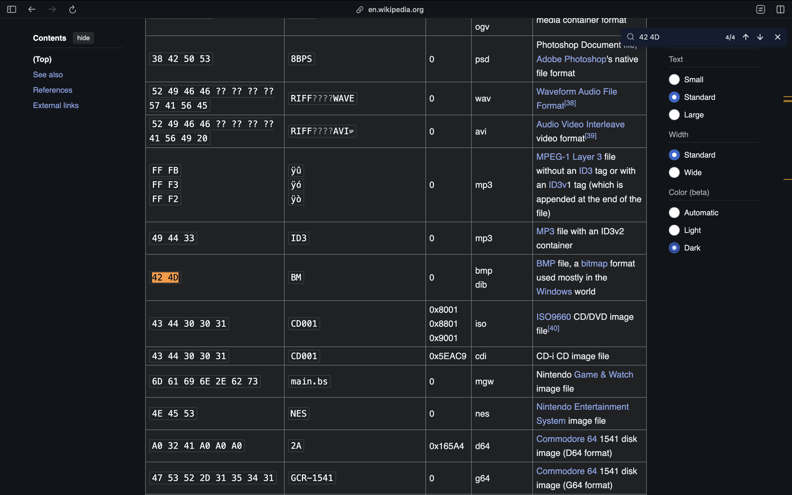
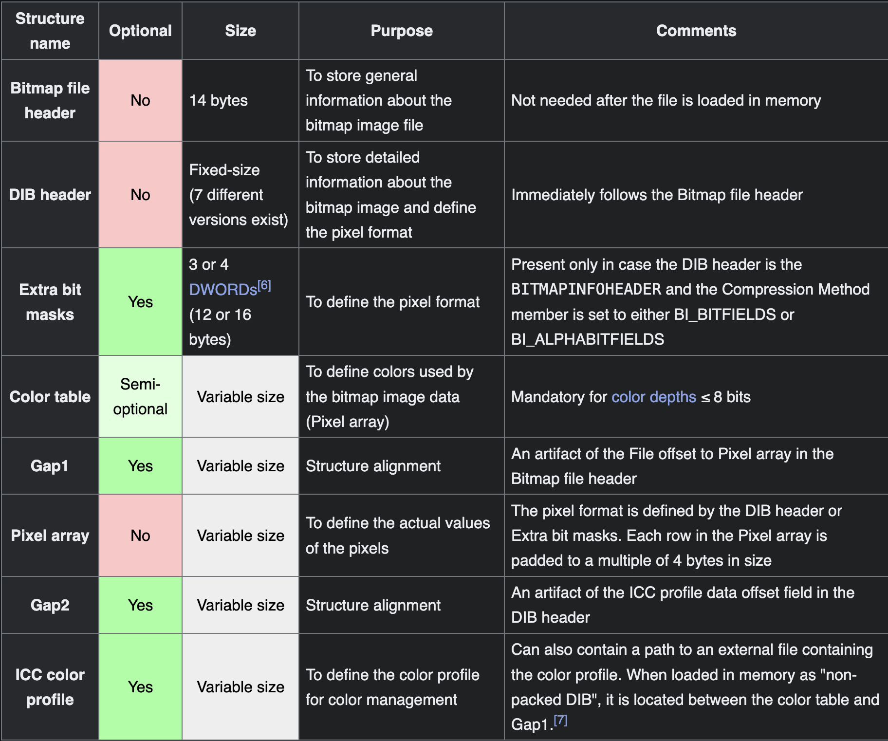
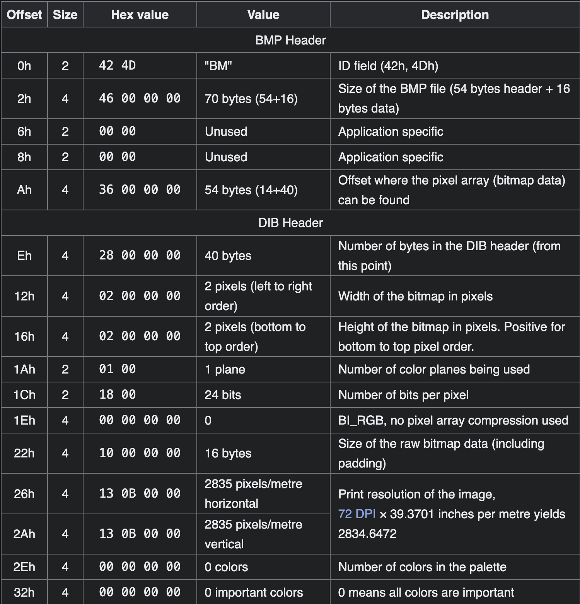
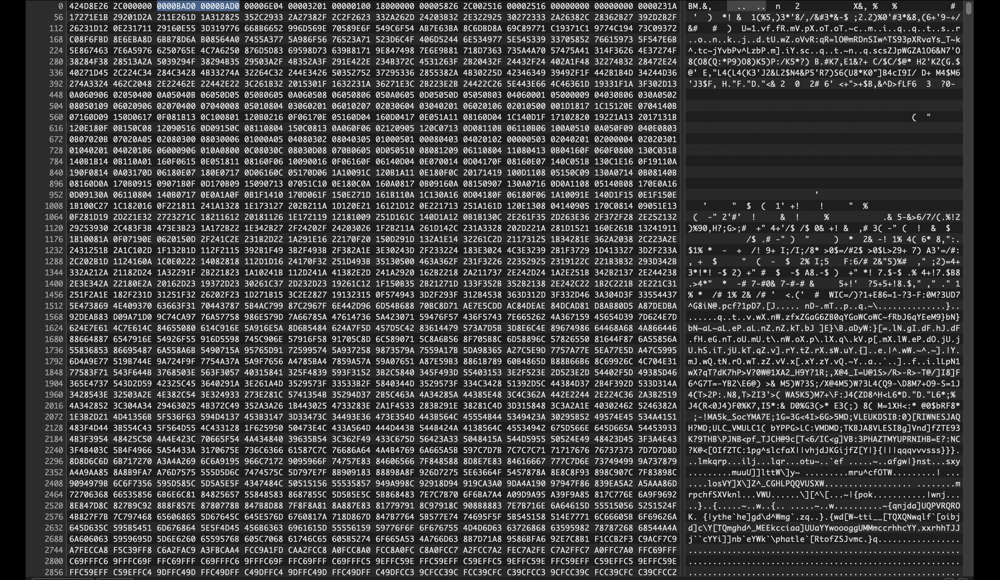
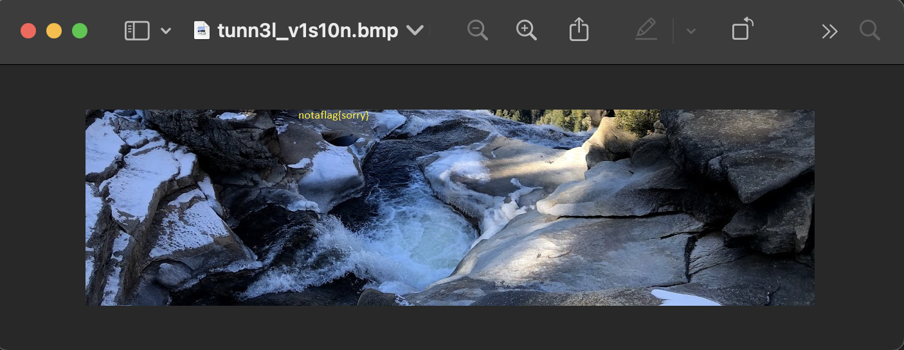
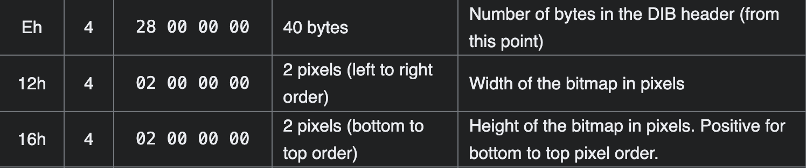
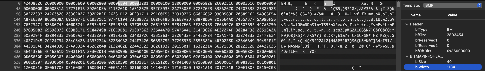
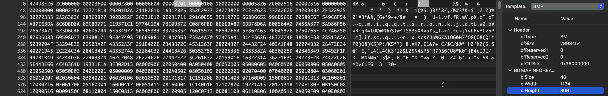
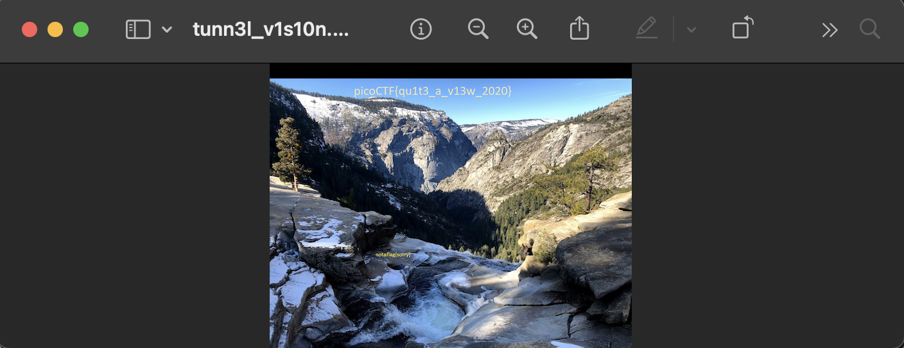

We get a file named `tunn3l_v1s10n`, now we have to figure out what it is and how to get our flag from it.
```bash
achu@air ~ % file /Users/achu/Downloads/tunn3l_v1s10n 
/Users/achu/Downloads/tunn3l_v1s10n: data
achu@air ~ % binwalk /Users/achu/Downloads/tunn3l_v1s10n 
Analyzed 1 file for 85 file signatures (187 magic patterns) in 27.0 milliseconds
achu@air ~ % sf /Users/achu/Downloads/tunn3l_v1s10n    
---
siegfried   : 1.11.1
scandate    : 2024-11-04T00:54:02+05:30
signature   : default.sig
created     : 2024-06-21T16:01:11+10:00
identifiers : 
  - name    : 'pronom'
    details : 'DROID_SignatureFile_V118.xml; container-signature-20240501.xml'
---
filename : '/Users/achu/Downloads/tunn3l_v1s10n'
filesize : 2893454
modified : 2024-11-04T00:27:44+05:30
errors   : 
matches  :
  - ns      : 'pronom'
    id      : 'UNKNOWN'
    format  : 
    version : 
    mime    : 
    class   : 
    basis   : 
    warning : 'no match'
```
`TRid` did not return any results either.
we're off to a spectacularly bad start...
Let's see the hex dump
```bash
achu@air ~ % xxd /Users/achu/Downloads/tunn3l_v1s10n 
00000000: 424d 8e26 2c00 0000 0000 bad0 0000 bad0  BM.&,...........
00000010: 0000 6e04 0000 3201 0000 0100 1800 0000  ..n...2.........
00000020: 0000 5826 2c00 2516 0000 2516 0000 0000  ..X&,.%...%.....
00000030: 0000 0000 0000 231a 1727 1e1b 2920 1d2a  ......#..'..) .*
00000040: 211e 261d 1a31 2825 352c 2933 2a27 382f  !.&..1(%5,)3*'8/
00000050: 2c2f 2623 332a 262d 2420 3b32 2e32 2925  ,/&#3*&-$ ;2.2)%
00000060: 3027 2333 2a26 382c 2836 2b27 392d 2b2f  0'#3*&8,(6+'9-+/
00000070: 2623 1d12 0e23 1711 2916 0e55 3d31 9776  &#...#..)..U=1.v
00000080: 668b 6652 996d 569e 7058 9e6f 549c 6f54  f.fR.mV.pX.oT.oT
00000090: ab7e 63ba 8c6d bd8a 69c8 9771 c193 71c1  .~c..m..i..q..q.
000000a0: 9774 c194 73c0 9372 c08f 6fbd 8e6e ba8d  .t..s..r..o..n..
```
Search wikipedia for matching magic number/binary signature


With a bit of digging it can be found that some static values of BMP are actually switched out in the hexdump



Correcting the values 


And... we can now open the file.

However there seems to be a sizing issue

Find the resolution
```bash
achu@air ~ % file /Users/achu/Downloads/tunn3l_v1s10n.bmp 
/Users/achu/Downloads/tunn3l_v1s10n.bmp: PC bitmap, Windows 3.x format, 1134 x 306 x 24, image size 2893400, resolution 5669 x 5669 px/m, cbSize 2893454, bits offset 54
achu@air ~ % 
```

Height and Width comes after the value we assigned `28` to.

Bitmap template tool in Hexfiend was a great aid



We edit those to a higher value (specfically set height to `900`, ie, `0x384`)
So we edit the value from `32 01` to `84 03`, and we finally get the flag!!!


The flag is `picoCTF{qu1t3_a_v13w_2020}`.
